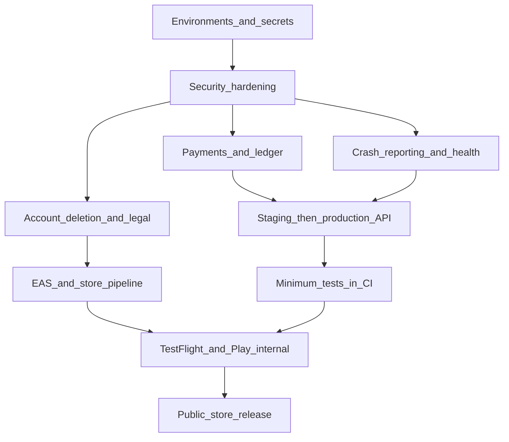

# Reborn — Go to Production

This document enumerates what must be done so Reborn can launch as a public product: App Store + Play Store + production API + production back office.

It is an execution backlog, not an implementation. Each item records the current gap, the work to do, and the acceptance criteria.

Related docs:

- Product domain: [../business/GENERAL-CONTEXT.md](../business/GENERAL-CONTEXT.md)
- Engineering conventions: [../dev/MOBILE-RULES.md](../dev/MOBILE-RULES.md), [../dev/BACKEND-RULES.md](../dev/BACKEND-RULES.md), [../dev/FRONTEND-RULES.md](../dev/FRONTEND-RULES.md)

---

## How to read this document

**Production** means all of the following are true at the same time:

- The mobile app is publicly listed on the Apple App Store and Google Play, pointing at a production API.
- The API and back office run in a dedicated production environment (not the current test SSH host).
- Real money movement is verified by a payment provider, not credited from a client request.
- Users can delete their account and read hosted, lawyer-reviewed legal pages.
- Crashes, deploys, and health failures are visible to the team.

### Priority key

| Priority | Meaning |
| --- | --- |
| **P0 — Launch blocker** | Cannot ship. Store rejection, data loss, unpaid money, or open security hole. |
| **P1 — Should have at launch** | Ship is possible, but operations or user trust are weak. |
| **P2 — Post-launch** | Important follow-up. Do not block the first public release on these unless a payment/KYC decision changes that. |

### Item template

Each work item uses:

- **What** — the concrete deliverable
- **Why** — store, security, legal, or ops reason
- **Current state** — the file-backed gap
- **What to implement** — the actual work
- **Done when** — acceptance criteria

Legal and tax items that need counsel are marked **needs legal / finance decision**. This document does not give legal advice.

---

## 1. Current readiness snapshot

Reborn is a mature in-development marketplace (jobs, chat, finance ledger, admin, i18n) running as a **test-environment product**. Feature breadth is high. Release infrastructure is not.

| Area | Rating | Notes |
| --- | --- | --- |
| Core product features | Medium–High | Jobs, chat, profiles, workflows, admin panel exist |
| Mobile store readiness | Very Low | No EAS, no mobile CI, no store metadata |
| Backend ops | Low–Medium | Docker + test deploy only; versions tagged `-T` |
| Payments | Very Low | Internal ledger credits on request; no payment provider |
| Testing | Very Low | Jest configured on the API; no meaningful specs |
| Observability | Very Low | No crash reporting, APM, or uptime monitoring |
| Security | Low–Medium | JWT auth exists; CORS, rate limits, token storage are not production-grade |
| Compliance | Low | In-app legal screens exist; delete account and hosted policy URLs do not |

### Version and environment signals

| Signal | Current value | Location |
| --- | --- | --- |
| API version | `1.0.1-T` | `reborn-api/package.json` |
| Back office version | `0.2.0-T` | `reborn-back-office/package.json` |
| Mobile package version | `1.0.1` | `reborn-mobile-app-v2/package.json` |
| Mobile app version | `1.0.0` | `reborn-mobile-app-v2/app.json` |
| Deploy pipelines | `Deploy Test` on `main` only | `reborn-api/.github/workflows/deploy-test.yml`, `reborn-back-office/.github/workflows/deploy-test.yml` |
| Mobile CI | None | `reborn-mobile-app-v2` has no `.github/workflows` |
| EAS | None | No `eas.json` |

The four folders (`reborn-mobile-app-v2`, `reborn-api`, `reborn-back-office`, `reborn-docs`) are separate git repositories. They do not need to be merged to go to production, but versioning and release coordination must be explicit.

---

## 2. Environments and configuration

Today only a **test** tier exists. Production requires four named environments with separate secrets, URLs, and OAuth apps.

| Environment | Audience | Data | Purpose |
| --- | --- | --- | --- |
| **dev** | Engineers | Local / disposable | Day-to-day coding |
| **test** | Internal QA | Shared, resettable | Current `TEST_ENV` SSH deploy |
| **staging** | Internal + store beta | Production-like, anonymized or synthetic | TestFlight / Play internal, payment sandbox |
| **production** | Real users | Real user data | Public stores and live money |

### 2.1 Separate secrets and env files — P0

**What.** One secret set per environment. No shared JWT, OAuth, SMTP, or MinIO credentials between test and production.

**Why.** A leaked test secret must not unlock production. Store OAuth redirect URIs and payment webhooks are environment-specific.

**Current state.** Each repo has a single `.env.example`. CI injects one GitHub secret blob named `ENV` into the test server. Mobile example is development-only:

```
EXPO_PUBLIC_MODE=development
EXPO_PUBLIC_API_BASE_URL=https://domain.com/
```

API example uses placeholders (`JWT_SECRET=secret`, `DATABASE_SYNCHRONIZE=true`). Back office example contains a hardcoded test IP (`GITHUB_CALLBACK_URL=http://151.80.147.210:3001/...`).

**What to implement.**

- Maintain `.env.example` as a schema only (no real hosts, no default secrets).
- Store real values in a secrets manager or per-environment GitHub Environments (`STAGING`, `PRODUCTION`), not one `secrets.ENV` file copied to disk.
- Create production OAuth apps (Google, LinkedIn, GitHub, Apple) with production redirect URIs.
- Create production SMTP and MinIO/S3 credentials.
- Point mobile `EXPO_PUBLIC_API_BASE_URL` and `EXPO_PUBLIC_API_SOCKET_URL` at the production API over HTTPS.
- Remove `EXPO_PUBLIC_GLOBAL_DELAY` from production builds (dev-only latency injection).
- Set `EXPO_PUBLIC_MODE=production` for store builds, or drop the unused flag if the app never reads it.

**Done when.** Staging and production can boot with distinct URLs and secrets. Rotating the test JWT does not invalidate production sessions.

### 2.2 Disable TypeORM synchronize in production — P0

**What.** Production and staging must run with `DATABASE_SYNCHRONIZE=false` and apply schema only through migrations.

**Why.** Synchronize can drop or alter columns on boot. That is data-loss risk on a live marketplace.

**Current state.** `reborn-api/.env.example` sets `DATABASE_SYNCHRONIZE=true`. Migrations in `reborn-api/src/main.ts` run only when synchronize is false. There is a single SQL file: `reborn-api/src/assets/migrations/V1_1__init_schema.sql`.

**What to implement.**

- Set `DATABASE_SYNCHRONIZE=false` (and `DATABASE_DROP_SCHEMA=false`) in staging and production.
- Generate a migration that matches the schema TypeORM currently creates, so test and prod are not two different sources of truth.
- Fail the API boot if a required migration has not been applied (today a migration error is only logged).
- Document the migration authoring path in the API README.

**Done when.** A production boot never calls synchronize. Schema changes ship as versioned SQL (or TypeORM migrations) reviewed in PRs.

### 2.3 Stop seeding on every install — P0

**What.** Production image builds and `yarn install` must not run the full seeder suite.

**Why.** `postinstall: yarn seed:all` in `reborn-api/package.json` runs permissions, roles, admin, templates, catalogs, and configuration on every install — including Docker production builds if scripts are not ignored. That can create or reset reference data at the wrong time.

**Current state.** `package.json` has `"postinstall": "yarn seed:all"`. The Dockerfile currently uses `--ignore-scripts`, which hides the problem rather than removing it. `seed:playground` and `@faker-js/faker` exist for synthetic users/jobs.

**What to implement.**

- Remove `postinstall` seeding. Run seeders as explicit commands (`yarn seed:all`) from a documented first-boot or ops runbook.
- Keep playground seeders out of production images (devDependency + never invoked in prod).
- First production deploy: run catalog seeders once, then treat catalogs as admin-managed data.

**Done when.** `yarn install` and Docker build do not touch the database. Playground data cannot appear in production.

### 2.4 Align versions — P1

**What.** One visible version per release train across mobile `app.json`, mobile `package.json`, API, and back office.

**Why.** Support tickets, crash reports, and store listings need a single number. `-T` suffixes signal a test artifact.

**Current state.** Mobile `app.json` is `1.0.0`, mobile `package.json` is `1.0.1`, API is `1.0.1-T`, back office is `0.2.0-T`.

**What to implement.**

- Pick a launch version (for example `1.0.0`) and set it in all four places before the first store submission.
- Drop `-T` on any artifact that ships to production.
- Add `ios.buildNumber` and `android.versionCode` in Expo config and increment them on every store upload.

**Done when.** A release notes entry can name one version and find matching binaries and API containers.

---

## 3. Security hardening

### 3.1 Store JWTs in SecureStore — P0

**What.** Persist access and refresh tokens in `expo-secure-store` (Keychain / Keystore), not AsyncStorage.

**Why.** AsyncStorage is unencrypted. A rooted device, backup, or malware can read session tokens and impersonate the user on a marketplace that holds money.

**Current state.** `reborn-mobile-app-v2/hooks/stores/useAuthPersistStore.ts` uses Zustand `persist` with `createJSONStorage(() => AsyncStorage)`.

**What to implement.**

- Switch the auth persist storage to `expo-secure-store`.
- Keep non-secret UI preferences in AsyncStorage if needed; do not persist tokens there.
- Plan a one-time migration: on upgrade, read any existing AsyncStorage session, write it to SecureStore, then delete the AsyncStorage copy.
- Confirm refresh-token rotation still works with `reborn-mobile-app-v2/api/axios.ts`.

**Done when.** Tokens are absent from AsyncStorage after login. Logout wipes SecureStore. A device backup does not export the refresh token in plain text.

### 3.2 Restrict CORS and Socket.IO origins — P0

**What.** Browser and WebSocket clients may only connect from known origins (back office production URL, maybe a future web app). Mobile native apps do not send Origin the same way; lock down the browser surface anyway.

**Why.** `app.enableCors()` with defaults and Socket.IO `origin: '*'` let any website call the API from a user's browser session.

**Current state.** `reborn-api/src/main.ts` calls `app.enableCors()` with no origin list. Notification gateway allows `origin: '*'`.

**What to implement.**

- Configure CORS from env (`CORS_ORIGINS=https://admin.reborn.example,...`).
- Apply the same allow-list to Socket.IO gateways (chat + notifications).
- Reject unknown browser origins in staging and production. Keep a looser list only for local dev.

**Done when.** A random website cannot call credentialed API routes. Mobile and the production back office still work.

### 3.3 Rate limiting — P0

**What.** Per-IP and per-user throttles on auth, top-up, password reset, and general API traffic.

**Why.** Without throttling, credential stuffing, SMS/email bombing, and wallet-abuse scripts are cheap.

**Current state.** No `@nestjs/throttler` (or equivalent) in the API.

**What to implement.**

- Add NestJS Throttler (or API-gateway limits) with stricter buckets on `/client-auth/*`, finance top-up, and file upload.
- Return `429` with a retry hint. Log repeat offenders.
- Put the public API behind a reverse proxy that can also rate-limit (see §8).

**Done when.** A script cannot mint unlimited sessions or credit unlimited funds from one IP. Auth and finance have documented limits.

### 3.4 Security headers — P1

**What.** Helmet (or equivalent) on the API and Next.js back office: HSTS, `X-Content-Type-Options`, restrictive `Referrer-Policy`, CSP on the admin app.

**Why.** Admin browsers handle privileged sessions. Missing headers are a common audit finding and an easy XSS amplifier.

**Current state.** `reborn-api/src/main.ts` has no Helmet. Back office has no documented security-header middleware.

**What to implement.**

- Enable Helmet on Nest with production-safe defaults.
- Configure Next.js security headers in `next.config` for the back office.
- Add a CSP that still allows NextAuth, maps, and the API origin.

**Done when.** `securityheaders.com` (or equivalent) on production admin and API docs does not fail the baseline checks you care about.

### 3.5 Turn off iOS arbitrary loads — P0

**What.** Remove `NSAllowsArbitraryLoads: true` so iOS App Transport Security requires HTTPS.

**Why.** Apple reviews ATS exceptions. Cleartext traffic can leak tokens and chat. Production API must be HTTPS anyway.

**Current state.** `reborn-mobile-app-v2/app.json` sets `ios.infoPlist.NSAppTransportSecurity.NSAllowsArbitraryLoads` to `true`.

**What to implement.**

- Delete the ATS exception (or limit it to a documented debug host behind a `__DEV__` config plugin).
- Serve API, sockets, MinIO public URLs, and OAuth callbacks on HTTPS with valid certificates.
- Re-test image/video loads and maps against HTTPS endpoints.

**Done when.** A production IPA cannot talk to `http://` API hosts. Store review does not need an ATS justification.

### 3.6 Production secrets with no fallbacks — P0

**What.** The API must refuse to start if `JWT_SECRET`, database password, or OAuth secrets are missing or equal to documented placeholders.

**Why.** `reborn-api/src/config/app.config.ts` falls back to `'secret'` when env is unset. A misconfigured container would issue forgeable JWTs.

**What to implement.**

- Fail fast on boot when required secrets are missing or match `secret` / `minioadmin` / example values.
- Rotate any secret that has ever been committed or used in test if it might be reused.
- Issue production JWT with a long random value; keep access TTL short and refresh rotation on.

**Done when.** Starting the API with the current `.env.example` values fails in `NODE_ENV=production`.

### 3.7 Keep expo-dev-client out of store binaries — P0

**What.** Production EAS profiles must not ship `expo-dev-client`.

**Why.** The dev client exposes debugger and extra native surface. Store builds should be release variants.

**Current state.** `expo-dev-client` is a production dependency in `reborn-mobile-app-v2/package.json`. Scripts start with `--dev-client`. There is no EAS production profile to exclude it.

**What to implement.**

- Keep the dev client for local/dev-client builds only.
- EAS `production` profile: release channel, no dev client, minify, production env file.
- Document `yarn dev` as engineer-only.

**Done when.** The uploaded AAB/IPA is a release build. `expo-dev-client` is not required at runtime in that profile.

---

## 4. Backend productionization

### 4.1 Migration-only schema — P0

Covered with §2.2. Additional implementation notes:

- Treat `V1_1__init_schema.sql` as insufficient if synchronize has drifted the live test schema.
- Dump the current test schema, diff it against the SQL file, and produce a catch-up migration before the first production import.
- Never run `DATABASE_DROP_SCHEMA=true` outside local disposable databases.

**Done when.** A clean MySQL and a migrated MySQL produce the same schema. Deploy runbooks apply migrations before traffic is switched.

### 4.2 Deep health checks — P0

**What.** `GET /api/health` (or equivalent) reports liveness vs readiness and checks MySQL and object storage.

**Why.** Load balancers and deploy scripts currently cannot tell a “process up, database down” failure from a healthy node. `AppService.getHealth()` returns `{ message: 'ok', timestamp }` only.

**What to implement.**

- Liveness: process is up.
- Readiness: MySQL `SELECT 1`, MinIO/S3 head-bucket or list, optional SMTP connect.
- Return non-200 when readiness fails. Do not expose internal hostnames or credentials in the body.
- Wire Docker `HEALTHCHECK` and the reverse proxy to the readiness route.

**Done when.** Stopping MySQL makes readiness fail while the process may still be alive. Deploy rollback can key off this.

### 4.3 Global exception filter — P1

**What.** A Nest global filter that logs the real error and returns a safe JSON body to clients.

**Why.** Unhandled exceptions can leak stack traces, SQL, or file paths. Mobile and back office need stable error codes.

**Current state.** Validation pipe and class-serializer are global; there is no documented exception filter in `main.ts`.

**What to implement.**

- Map known domain errors to HTTP status + machine-readable `code`.
- In production, never send `stack` to the client. Send it to logs / Sentry (§9).
- Keep Swagger disabled outside development (already the case).

**Done when.** Forcing a 500 in production returns a generic body. The same event appears in logs with a request id.

### 4.4 Docker runtime consistency — P1

**What.** Build and run the API on the same Node major, with a container healthcheck.

**Why.** `reborn-api/dockerfile` builds on `node:22-alpine` and runs on `gcr.io/distroless/nodejs20-debian12`. That mismatch can hide native-module or runtime bugs.

**What to implement.**

- Pin builder and runtime to the same Node 20 or 22 LTS.
- Add `HEALTHCHECK` (or a sidecar probe) calling the readiness URL. Distroless has no shell — use a dedicated probe or proxy-level checks.
- Confirm `yarn seed:all` is not invoked in the image (Dockerfile already uses `--ignore-scripts`; keep it after §2.3).

**Done when.** Image tags document the Node version. Staging and production run the same Dockerfile.

### 4.5 Keep playground and faker out of production — P1

**What.** Production dependencies and images exclude `@faker-js/faker` and playground seed commands.

**Why.** Accidental `seed:playground` on production would create fake users and jobs next to real ones.

**What to implement.**

- Move faker to `devDependencies`.
- Guard playground commands so they refuse to run when `NODE_ENV=production`.
- Do not copy `src/seeders/data/playground-*.ts` into a slim production build if you split build artifacts later.

**Done when.** Production `node_modules` does not include faker. Playground commands no-op or exit 1 in production.

---

## 5. Payments and marketplace money

This is the largest product gap. Reborn already has an internal wallet, points, and a transaction ledger. It does **not** collect or verify real payments.

**Current state.**

- `POST` top-up on `reborn-api/src/modules/finance/controllers/finance.controller.ts` calls `fundsService.addFunds(..., TransactionType.BOUGHT_VIA_CREDIT_CARD)` with no payment-provider charge or webhook.
- Mobile finance UI includes a mock Visa (`4242`) and a “Pay Now” action that hits that API.
- Job payloads expose `paymentVerified` hardcoded to `false` in job management.
- Currency in translations is TND (Tunisian Dinar).

**Needs legal / finance decision:** entity that holds user funds, PSP choice for Tunisia / target markets, whether in-app credit purchases must use Apple IAP / Google Play Billing, KYC for payouts, invoicing and tax reporting.

### 5.1 Choose and integrate a payment provider — P0

**What.** A real PSP (or local acquirer) for card / wallet top-ups, plus a documented decision on IAP if credits are digital goods.

**Why.** Crediting a balance from an authenticated API call is fraud. Stores also reject or constrain apps that sell digital credits outside IAP.

**What to implement.**

- Product + finance pick: card PSP vs local methods vs IAP-only for credits. Record the decision in this repo when it is made.
- Client: PSP SDK or hosted checkout; remove the mock Visa card from `FinanceOverviewTab`.
- Server: create a PaymentIntent / checkout session; **do not** credit the ledger in the client-facing top-up handler.
- Webhook endpoint: verify signature, idempotently credit `addFunds` only on success.
- Store `provider`, `providerPaymentId`, amount, currency, and status on a `payments` table (or equivalent) linked to the ledger row.

**Done when.** A real sandbox payment credits the wallet once. Replaying the webhook does not double-credit. An unauthenticated or unsigned webhook is rejected. Failed payments credit nothing.

### 5.2 Escrow or hold through the job lifecycle — P0

**What.** Client funds for a job are reserved when work is accepted and released on success (or refunded on failure), matching the XState job flow in [GENERAL-CONTEXT.md](../business/GENERAL-CONTEXT.md).

**Why.** A marketplace that lets the worker start without reserved funds, or that pays out before review, will take disputes as operating losses.

**What to implement.**

- Define the money state machine: authorized / captured / held / released / refunded. **Needs finance decision** on whether you capture immediately and hold in-platform, or use PSP escrow/separate charges.
- On `Accept Candidate` / `Not Started`: require sufficient reserved funds; set `paymentVerified` from real payment state, not `false`.
- On `Successful`: release worker share minus platform fee.
- On `Failed` / cancelled: refund policy documented and implemented.
- Admin tools in the back office to inspect holds and trigger a manual release with an audit log.

**Done when.** A job cannot enter in-progress states without a hold. Ledger + PSP dashboard match for a happy-path job and a failed job.

### 5.3 Worker payouts — P0

**What.** Workers can withdraw available (released) balance to a bank account or supported wallet.

**Why.** A balance they cannot cash out is not a marketplace. Payouts have KYC/AML constraints — **needs legal / finance decision**.

**What to implement.**

- Payout request API + admin approval or automated PSP transfer.
- Minimum balance, fees, and cooling-off rules as configuration (the configuration module already exists).
- Never allow payout of held/escrowed funds.
- Identity checks required by the chosen PSP and jurisdiction.

**Done when.** A worker with released funds can be paid in sandbox. Held funds cannot be withdrawn. Every payout has an audit row.

### 5.4 Remove mock payment UI and unverified flags — P0

**What.** Production UI only shows real payment methods and real verification state.

**Why.** Mock cards and `paymentVerified: false` train users and reviewers that payments are fake.

**What to implement.**

- Delete hardcoded Visa UI.
- Bind job and finance screens to payment records.
- Hide or disable top-up if the PSP is down (feature flag / config).

**Done when.** No `4242` or “fake card” strings ship in the production binary. `paymentVerified` reflects ledger/PSP state.

### 5.5 Tax and invoicing — P2 (decision is P0)

**What.** Invoices, receipts, and tax treatment for TND (or other) marketplace fees.

**Why.** Once real money moves, receipts and tax identity are required in most jurisdictions. **Needs legal / finance decision** before launch, even if full invoicing ships shortly after.

**What to implement.**

- Record enough data to issue a receipt (amount, fee, parties, timestamp, payment id).
- Decide VAT/withholding treatment; do not invent it in code.
- Expose a downloadable receipt in-app when finance signs off.

**Done when.** Finance has a written tax approach. Engineering stores the fields that approach needs. Launch is not blocked on a full accounting suite if receipts + PSP dashboard are enough for v1 — that call belongs to finance.

---

## 6. Account, legal, and store compliance

Apple and Google reject marketplace apps that cannot delete accounts or that lack a public privacy policy URL.

### 6.1 Delete account — P0

**What.** A logged-in user can permanently delete (or anonymize) their account from Settings, and the API honors that.

**Why.** App Store Guideline 5.1.1(v) and Google Play account-deletion policy require this in-app, not only by email.

**Current state.** `reborn-mobile-app-v2/components/settings/SettingsPortal.tsx` shows `Alert.alert("Delete account", "Coming soon!")`.

**What to implement.**

- API: authenticated delete/anonymize that revokes tokens, removes or hashes PII, cancels open jobs per a written policy, and stops email.
- Define what happens to chat, reviews, and open escrow — **needs legal / product decision**.
- Mobile: confirmation, password/biometric reauth, then call the API and sign out.
- Honor deletion requests that arrive from store forms within the required window.

**Done when.** After deletion, login fails, tokens do not refresh, and PII is gone or irreversibly anonymized per the written policy. Support can verify on a staging user.

### 6.2 Hosted privacy policy and terms URLs — P0

**What.** Public HTTPS pages for Privacy Policy and Terms, linked from store listings and the app.

**Why.** Store consoles require a URL. In-app-only screens are not enough. Reviewers and users must open them without installing the app.

**Current state.** In-app screens exist (`TermsAndConditions.tsx`, `PrivacyPolicy.tsx`, plus i18n legal in the auth flow). No hosted marketing/legal site is in these repos.

**What to implement.**

- Host lawyer-reviewed pages (marketing site, GitHub Pages, or the back office public routes).
- Put the URLs in App Store Connect, Play Console, and in-app “open in browser” links.
- Localize en / fr / ar. Settings screens today are hardcoded English; auth legal is i18n — unify on the hosted source of truth.

**Done when.** The URLs load without auth, match the in-app summary, and are pasted into both store consoles.

### 6.3 GDPR / data export — P1

**What.** A user can download a machine-readable archive of their personal data.

**Why.** If you serve EU/EEA users (or Tunisia’s data-protection obligations once counsel maps them), export is expected. The UI already advertises it as “Soon” in `PrivacySecurityPortal.tsx`. **Needs legal decision** on exact scope and lawful bases.

**What to implement.**

- API job that assembles profile, jobs, chat metadata, finance summary (not raw card data).
- Deliver via email link or in-app download with expiry.
- Do not block v1 if counsel confirms the first market does not require it — but then remove the “Soon” row so you do not advertise a missing right.

**Done when.** Either export works end-to-end on staging, or the UI no longer promises it.

### 6.4 Lawyer-reviewed, localized legal copy — P0

**What.** Terms, privacy, and store declarations reviewed by counsel and translated.

**Why.** Hardcoded English with “Updated Feb 5, 2026” is a placeholder. Marketplace + payments + chat increase liability.

**What to implement.**

- Counsel drafts / reviews. **Needs legal decision.**
- Translate to en / fr / ar.
- Replace dating-app leftover FAQ copy in `FaqsPortal.tsx` (“Instinct”, swipe/match) with Reborn content.

**Done when.** Legal signs off. FAQ is about jobs, payments, and accounts. No third-product names remain.

### 6.5 Store privacy nutrition labels and Data Safety — P0

**What.** Accurate App Store Privacy Nutrition Labels and Play Data Safety form.

**Why.** False declarations are a rejection and a trust issue. The app uses location, photos, Face ID (finance reveal), audio permission, and account data.

**What to implement.**

- Inventory data collected (account, location, photos, chat, device, diagnostics once Sentry exists).
- Declare purpose and linked/third-party sharing (PSP, Maps, OAuth, email, crash tool).
- Add iOS Privacy Manifest / required reason APIs as Expo/SDK versions require.
- Align Face ID usage strings with actual use (finance reveal today).

**Done when.** Store forms match the inventory. A reviewer can reconcile them with the privacy policy.

### 6.6 Two-factor authentication — P2

**What.** Optional TOTP or SMS 2FA for users (especially those with a balance).

**Why.** The privacy screen already shows “Soon”. Not a store blocker. Become P1 if finance/KYC requires it.

**What to implement.** Only after launch unless a PSP mandates it. Until then, do not advertise 2FA as imminent if it is unscheduled.

**Done when.** Either 2FA ships, or the badge is removed.

### 6.7 Back-office cookies — P1

**What.** If the admin app uses non-essential cookies/localStorage beyond NextAuth, add a consent notice.

**Why.** Next.js admin is a web surface. EU access to admin is enough to care. **Needs legal decision.**

**What to implement.** Document what is stored (`next-i18next` localStorage cache, session). Add a banner only if counsel says it is required.

**Done when.** Counsel has reviewed the admin cookie/storage list.

---

## 7. Mobile store release pipeline

Nothing in `reborn-mobile-app-v2` can produce a signed store binary in CI today.

### 7.1 EAS project and build profiles — P0

**What.** An Expo/EAS project with `development`, `preview`, and `production` profiles.

**Why.** Native directories are gitignored. Store builds need EAS Build (or a committed prebuild you do not have).

**Current state.** No `eas.json`. Scripts are `dev` / `android` / `ios` / `web` / `clean` only. `android/` and `ios/` are gitignored.

**What to implement.**

- Create the Expo organization/project; add `eas.json`.
- `development`: dev client, internal.
- `preview`: internal distribution / APK or ad-hoc, staging API.
- `production`: store AAB + IPA, production API, no dev client.
- Store production env in EAS secrets (`EXPO_PUBLIC_*`).
- Add `yarn lint` / typecheck scripts and run them in EAS or GitHub Actions before build.

**Done when.** `eas build --profile production --platform all` produces signed artifacts without local native folders.

### 7.2 Signing and bundle identifiers — P0

**What.** Stable iOS bundle ID and Android application id, plus certificates in EAS.

**Why.** Changing IDs later is a new app. Current IDs are inconsistent.

**Current state.** iOS `bundleIdentifier`: `reborn-mobile-app`. Android `package`: `com.softsurgery.rebornmobileappv2`.

**What to implement.**

- Decide one reverse-DNS family, e.g. `com.softsurgery.reborn` on both platforms, **before** the first store record. If test devices already use the old IDs, migrate now, not after public launch.
- Apple Developer + App Store Connect app record. Play Console app record.
- Let EAS manage credentials, or upload them once and document who can revoke them.

**Done when.** Both store listings exist. A second production build increments versionCode/buildNumber on the same IDs.

### 7.3 Versioning policy — P1

**What.** `version` (user-facing) + monotonic `buildNumber` / `versionCode` on every upload.

**Why.** Stores reject reused version codes. Support needs to know which binary a user has.

**What to implement.**

- Single source in `app.config` / `app.json`.
- CI or EAS `autoIncrement`.
- Changelog in the store listing per release.

**Done when.** Two consecutive preview builds cannot share a versionCode.

### 7.4 TestFlight and Play internal testing — P0

**What.** Closed beta on both stores against **staging**.

**Why.** First public build should not be the first time real devices hit OAuth, push, maps, and payments.

**What to implement.**

- TestFlight group and Play internal/closed track.
- Staging API + PSP sandbox.
- Device matrix: see §10.
- Fix crashes from §9 before promoting to production.

**Done when.** Internal testers complete login, job apply, chat, and sandbox top-up on iOS and Android.

### 7.5 Store listing assets — P0

**What.** Screenshots, feature graphic, short/long description, support URL, marketing URL, privacy URL, category, age rating.

**Why.** Submission is incomplete without them. Localized listings (en/fr/ar) match the app’s i18n.

**Current state.** Icon and splash exist (`assets/images/reborn.png`, adaptive icon). No screenshot set or store copy in repo.

**What to implement.**

- Capture screenshots on required phone sizes (and tablet if `supportsTablet` stays true).
- Write store copy that does not overclaim payments or 2FA.
- Add a support email/URL that a human reads.
- Age rating: marketplace + chat + user content — fill the questionnaires honestly.

**Done when.** Both consoles show a complete listing in at least English; fr/ar recommended at launch.

### 7.6 Universal Links and App Links — P1

**What.** `https://` links open the app (OAuth return, password reset, job share). Keep the custom scheme as fallback.

**Why.** Custom scheme `rebornmobileapp` is easy to hijack and worse for email/OAuth. Deep-link test UI is commented out in Settings.

**What to implement.**

- Associated domains / Digital Asset Links for the production host.
- Expo Router routes for job, conversation, and OAuth.
- Host `apple-app-site-association` and `assetlinks.json`.

**Done when.** A production HTTPS job URL opens the job screen on a device with the app installed.

### 7.7 Remote push notifications — P0

**What.** Device tokens registered with the API; Expo Push (or FCM/APNs) delivered when the user is backgrounded.

**Why.** Product copy already describes push for jobs, chat, and follows. Today `expo-notifications` is used for local/foreground alerts; the backend notification gateway is WebSocket-only. Offline users only see DB notifications after they reopen the app.

**What to implement.**

- Mobile: request permission, get Expo push token, PUT it to the API, refresh on rotate.
- API: store tokens per user/device; send via Expo Push on the same events the gateway already emits.
- APNs key + FCM credentials in EAS.
- Respect notification settings already in the app.

**Done when.** A killed app on iOS and Android receives a chat or job-request notification. Uninstall/invalid tokens are pruned.

---

## 8. API and back-office production deploy

Current pattern: on push to `main`, GitHub Actions builds a Docker image, SCPs `image.tar` + `.env` to one host, `docker stop && docker rm && docker run --network host`. That is a test lab, not production.

### 8.1 Staging then production pipelines — P0

**What.** Separate workflows and hosts (or clusters) for staging and production, with manual approval on production.

**Why.** Every merge to `main` currently can replace the only running server. Production needs a promote step.

**What to implement.**

- `deploy-staging.yml` on `main` or a `staging` branch.
- `deploy-production.yml` on version tags or a `release` branch, environment protection rules, required reviewers.
- Do not deploy production from an unchecked `main` push.
- Keep `deploy-test.yml` for the existing lab if still useful; do not point stores at it.

**Done when.** A merge can update staging without touching production. Production deploy is an explicit, audited action.

### 8.2 CI gates before deploy — P0

**What.** Lint, typecheck, and the minimum test set (§10) must pass before an image is pushed.

**Why.** Both current workflows build and run with no test step.

**What to implement.**

- API: `yarn lint` (without `--fix` in CI), `yarn test`, `yarn test:e2e` once those tests exist.
- Back office: `yarn lint`, `yarn build` as a compile gate, plus login test when it exists.
- Mobile: typecheck/lint on PR; EAS build on main/tags.
- Fail the pipeline on test failure. Do not use `--no-verify` locally as a habit.

**Done when.** A broken unit test blocks staging deploy.

### 8.3 TLS and reverse proxy — P0

**What.** HTTPS termination in front of API, sockets, MinIO public endpoints, and the back office.

**Why.** `APP_SSL=true` exists in API env example; no nginx/Caddy/Traefik config lives in the repos. `--network host` exposes Node directly.

**What to implement.**

- Caddy or nginx with Let’s Encrypt (or a cloud load balancer).
- Proxy `/api` and Socket.IO upgrades to the API container; proxy admin to the Next server.
- Redirect HTTP to HTTPS. Disable `network host` in favor of published ports on an internal network.
- WebSocket paths verified (chat + notifications).

**Done when.** `https://api...` and `wss://` work with a valid public certificate. Port 5000 is not open to the world.

### 8.4 Secrets management — P1

**What.** Replace the single `echo "${{ secrets.ENV }}" > .env` blob with per-key secrets or a vault.

**Why.** One blob is hard to rotate, easy to leak in logs, and is copied to the server filesystem next to the image.

**What to implement.**

- GitHub Environment secrets per variable, or Doppler/Vault/cloud secret manager injected at runtime.
- Do not SCP `.env` as a file if the platform can inject env into the container.
- Restrict SSH keys to deploy users; prefer OIDC to a container registry instead of shipping `image.tar` over SSH when you can.

**Done when.** Rotating `JWT_SECRET` is one secret change + rolling restart. The old blob is gone from the server.

### 8.5 Backups and rollback — P0

**What.** Daily automated MySQL + MinIO backups, a tested restore, and a documented rollback (previous image tag).

**Why.** Marketplace data (chat, jobs, ledger) cannot be reconstructed from git. The current deploy deletes the running container with no image retain policy described.

**What to implement.**

- Tagged images in a registry (`reborn-api:1.0.0`) so rollback is `docker run` of the previous tag.
- MySQL dump or managed-DB PITR. MinIO versioning or `mc mirror` off-box.
- Restore drill on staging at least once before launch.
- Named on-call owner for rollback (see §12 checklist).

**Done when.** You have restored staging from last night’s backup. Production rollback does not require a rebuild from `main`.

### 8.6 Back-office production config — P1

**What.** Production `NEXTAUTH_URL`, `NEXTAUTH_SECRET`, API `BASE_URL`, and OAuth callbacks on public HTTPS — no test IPs.

**Why.** `.env.example` uses `NEXTAUTH_SECRET=secret` and `GITHUB_CALLBACK_URL=http://151.80.147.210:3001/...`.

**What to implement.**

- Unique `NEXTAUTH_SECRET` in production.
- `NEXTAUTH_DEBUG=false`.
- Restrict admin access (VPN, IP allow-list, or SSO-only) — do not leave a public admin with only a password on the open internet if you can avoid it.
- Version: drop `0.2.0-T` for the first production tag.

**Done when.** Admin login via credentials and SSO works on the production hostname. The test IP does not appear in any production env.

---

## 9. Observability

There is no Sentry, Crashlytics, product analytics SDK, APM, or uptime check in any package. The API has a DB-backed audit logger and `@LogEvent` interceptors. Mobile health polling logs failures with `console.log`.

### 9.1 Crash reporting — P0

**What.** Sentry (or Crashlytics + a backend equivalent) on mobile, API, and back office.

**Why.** Store reviews and first-week crashes are invisible without this. You cannot fix what you do not see.

**What to implement.**

- Mobile: `@sentry/react-native` (or Expo Sentry) with release = app version + build number. Source maps uploaded from EAS.
- API: `@sentry/nestjs` (or equivalent) hooked to the exception filter.
- Back office: `@sentry/nextjs`.
- Separate DSN / environment tags for staging vs production.
- Privacy: strip tokens and precise location from breadcrumbs.

**Done when.** A forced test crash from a staging build appears in the dashboard with a release tag within a minute.

### 9.2 Structured logs and aggregation — P1

**What.** JSON logs to stdout + a collector (Loki, CloudWatch, Axiom, etc.) with request ids.

**Why.** SSH-ing into one host does not scale. Audit rows in MySQL are not a substitute for request logs.

**What to implement.**

- Correlate `x-request-id` across API and reverse proxy.
- Do not log Authorization headers or card data.
- Retain enough days to debug a payout dispute.

**Done when.** You can search production logs by user id and request id without SSH.

### 9.3 Alerting and uptime — P0

**What.** Pages or Slack/email on: readiness failing, deploy failed, error-rate spike, certificate expiry.

**Why.** Otherwise the first reporter is a store review or a user.

**What to implement.**

- Uptime monitor on API readiness and back-office login page from outside the host.
- Alert on Sentry error-rate threshold and on GitHub Actions production failure.
- On-call rotation even if it is one person at launch.

**Done when.** Stopping the staging API notifies someone who is not watching the terminal.

### 9.4 Product analytics — P1

**What.** Funnel events: signup, job post, apply, hire, top-up success — if product wants them at launch.

**Why.** Useful, not a store blocker. Do not add a second SDK if Sentry breadcrumbs are enough for v1.

**What to implement.** Only after privacy labels (§6.5) include the vendor. Prefer one tool.

**Done when.** Either a documented “no analytics at v1” decision, or events appear for the core funnel without PII in properties.

---

## 10. QA and release quality

Jest is configured on the API; there are no `*.spec.ts` files of value. The e2e scaffold (`test/app.e2e-spec.ts`) still expects `Hello World!`. Mobile and back office have no test scripts. CI does not run tests.

Do not attempt full coverage before launch. Ship a **minimum viable test set**.

### 10.1 API minimum tests — P0

**What.** Automated tests that run in CI for the money and auth paths.

**What to implement.**

- Auth: register, login, refresh, rejected bad password.
- Finance: webhook credits once; unsigned webhook does not credit; insufficient funds cannot start a paid job once escrow exists.
- Job workflow: post → apply → approve → (money hold) happy path.
- Fix or delete the stale `Hello World!` e2e.

**Done when.** `yarn test` and a thin e2e job are green in CI on every API PR.

### 10.2 Mobile smoke — P1

**What.** A Maestro (or Detox) flow: launch → login → open a job → apply → open chat. Plus one RTL/Arabic screenshot smoke.

**Why.** EAS will not catch broken navigation. Unit tests are welcome but not the launch bottleneck.

**What to implement.**

- Add a `test` / `e2e` script. Run on PR against a staging or mock API if feasible; otherwise run on preview builds before store promote.
- Manual matrix remains required (§10.4).

**Done when.** One automated smoke exists or a written manual smoke is executed and signed off for each store candidate (automated preferred).

### 10.3 Back-office login test — P1

**What.** One Playwright/Cypress (or similar) test: admin login lands on the dashboard.

**Done when.** The test runs in CI on back-office PRs.

### 10.4 Manual device matrix — P0

**What.** A signed-off pass on real devices before each production store submit.

| Surface | Must pass |
| --- | --- |
| iPhone (recent iOS) | Login (password + Google + Apple if enabled), job apply, chat media, sandbox pay, push, Face ID finance reveal |
| Android (recent + one older) | Same, plus Play billing/PSP if used |
| en / fr / ar | Critical screens readable; Arabic layout usable even if native RTL is still JS-based |
| Offline | Banner or blocking state — not a silent `console.log` (§11.1) |
| Permissions | Location, photos, notifications, microphone if still requested |

**Done when.** A checklist is attached to the release ticket. Failures block promote.

### 10.5 Load testing — P2

**What.** A simple soak on auth + job list + socket connect.

**Why.** Nice before a marketing spike; not a first-submit blocker if v1 traffic is small.

---

## 11. Product polish that blocks trust

### 11.1 Offline and API-down UX — P1

**What.** Users see a clear state when the network or health check fails.

**Why.** `useCheckHealth` currently logs failures and does not drive UI. A silent broken home feed looks like a shipped bug.

**What to implement.**

- Subscribe to network status; show a banner or full-screen retry.
- Fail payments and sends with an explicit error, not a hung spinner.
- Keep React Query persistence as a read cache; label stale data if you show it offline.

**Done when.** Airplane mode produces a visible, recoverable state on home, chat, and finance.

### 11.2 Arabic on the back office — P2

**What.** Admin `ar` locale parity with mobile.

**Why.** Mobile already ships `en` / `fr` / `ar`. Admins serving Arabic users should not work in English only. Not a consumer-store blocker.

**Done when.** Either `public/locales/ar` exists for critical admin views, or launch notes say admin is en/fr only.

### 11.3 Placeholder and leftover content — P0

**What.** Production binaries contain only Reborn copy.

**Why.** Dating-app FAQ text, mock cards, “Coming soon” account deletion, and leftover deep-link debug rows fail review and trust.

**What to implement.**

- Rewrite `FaqsPortal.tsx`.
- Remove or implement Coming Soon rows that stores will tap (delete account is P0; 2FA can be hidden).
- Remove `lib/notification-manager.ts` console-stub if unused.
- Hide commented debug navigation in Settings.

**Done when.** A string search for Instinct / swipe / Coming soon / 4242 in production source is empty or justified.

---

## 12. Suggested implementation order

Do not start store screenshots before payments and delete-account exist — reviewers will exercise both.



### Phase A — Foundations (P0)

1. Name staging and production; create secrets and OAuth apps (§2.1, §3.6).
2. `DATABASE_SYNCHRONIZE=false`, catch-up migration, stop `postinstall` seed (§2.2, §2.3, §4.1).
3. SecureStore tokens, CORS, rate limits, ATS, no JWT fallback (§3).
4. Deep health + HTTPS reverse proxy (§4.2, §8.3).
5. Sentry + uptime (§9.1, §9.3).

### Phase B — Money and legal (P0)

6. PSP + webhooks + remove mock UI (§5.1, §5.4).
7. Escrow/hold aligned to job states + payouts (§5.2, §5.3).
8. Delete account + hosted legal URLs + store privacy forms (§6).
9. Finance/legal sign-off on tax and IAP (**decision**, even if invoicing is P2).

### Phase C — Release machinery (P0)

10. EAS profiles, IDs, CI gates (§7.1–7.3, §8.2).
11. Staging deploy + production deploy with rollback and backups (§8.1, §8.5).
12. Minimum API tests in CI (§10.1).
13. Remote push (§7.7).

### Phase D — Beta then public

14. Listings, TestFlight / Play internal (§7.4, §7.5).
15. Manual device matrix + placeholder purge (§10.4, §11.3).
16. Promote API to production; point production EAS profile at it; submit stores.

### Phase E — Shortly after launch (P1–P2)

- Universal Links, analytics, 2FA, admin Arabic, load test, cookie banner, full invoicing.

---

## 13. Go-live checklist

Complete this the day you flip stores to production. An unchecked P0 item means **do not submit**.

### Accounts and access

- [ ] Apple Developer + App Store Connect app record exist; EAS credentials uploaded
- [ ] Play Console app record exists; Play upload key in EAS
- [ ] Production Google / Apple / LinkedIn / GitHub OAuth apps point at production URLs
- [ ] Production SMTP verified (auth email, reset, receipts)
- [ ] PSP live keys stored only in production secrets; webhook URL is HTTPS and verified
- [ ] Expo / EAS project; production env vars set
- [ ] Sentry (or equivalent) projects for mobile, API, admin — production environment
- [ ] Uptime monitor on API readiness and admin
- [ ] Named rollback owner and backup restore owner

### Configuration

- [ ] Production `JWT_SECRET` is unique, not `secret`; API refuses placeholder secrets
- [ ] `DATABASE_SYNCHRONIZE=false`; migrations applied
- [ ] Seeders were run once on purpose; `postinstall` does not seed
- [ ] CORS and Socket.IO allow-lists are production hosts only
- [ ] Mobile production binary uses HTTPS API + socket URLs; ATS exception removed
- [ ] Tokens live in SecureStore
- [ ] `expo-dev-client` is not in the store artifact
- [ ] Versions aligned; `-T` suffixes gone; versionCode/buildNumber incremented
- [ ] Back office `NEXTAUTH_*` on the public HTTPS host; no test IPs

### Data and ops

- [ ] MySQL backup ran and a restore was tested on staging
- [ ] MinIO/S3 backup or versioning is on
- [ ] Previous production image tag is retained for rollback
- [ ] TLS certificates auto-renew; HTTP redirects to HTTPS
- [ ] Health readiness fails if the database is down
- [ ] Production deploy requires approval and ran a staging twin first

### Product and compliance

- [ ] Sandbox payment credits once via webhook; live PSP smoke done by finance
- [ ] Job flow reserves and releases funds as designed
- [ ] Worker payout sandbox proven; live payout policy written
- [ ] Delete account works on staging and is in the production binary
- [ ] Privacy and terms URLs load publicly and are in both store consoles
- [ ] Privacy Nutrition Labels and Data Safety match the inventory
- [ ] FAQ and finance UI have no placeholder / dating-app / mock-card copy
- [ ] Push received on a killed iOS and Android app
- [ ] Support email/URL is staffed

### QA

- [ ] API minimum tests green on the release commit
- [ ] Manual device matrix signed off (iOS, Android, en/fr/ar)
- [ ] TestFlight / Play internal build with **production** API was not the first time testers saw the app (staging beta already happened)
- [ ] Known open bugs triaged; none are P0

### Submit

- [ ] Production API is live and monitored
- [ ] Production EAS build uploaded
- [ ] Store listings complete (screenshots, age rating, support URL)
- [ ] Review notes mention account deletion path and test login if reviewers need one
- [ ] Team knows how to roll back the API and halt store rollout (staged rollout on Play)

After approval: watch Sentry and uptime for 72 hours, keep a freeze on risky schema changes, and schedule Phase E items.

---

## 14. Work item index

| ID | Item | Priority | Area |
| --- | --- | --- | --- |
| 2.1 | Separate env/secrets per tier | P0 | Config |
| 2.2 | Disable synchronize; migrations only | P0 | API |
| 2.3 | Remove postinstall seeding | P0 | API |
| 2.4 | Align versions; drop `-T` | P1 | All |
| 3.1 | SecureStore for JWTs | P0 | Mobile |
| 3.2 | CORS / Socket.IO allow-list | P0 | API |
| 3.3 | Rate limiting | P0 | API |
| 3.4 | Security headers | P1 | API / Admin |
| 3.5 | Disable iOS ATS exception | P0 | Mobile |
| 3.6 | Fail boot on placeholder secrets | P0 | API |
| 3.7 | No dev client in store builds | P0 | Mobile |
| 4.1 | Catch-up migration vs synchronize drift | P0 | API |
| 4.2 | Deep health checks | P0 | API |
| 4.3 | Global exception filter | P1 | API |
| 4.4 | Docker Node pin + HEALTHCHECK | P1 | API |
| 4.5 | Guard playground seeders | P1 | API |
| 5.1 | Payment provider + webhooks | P0 | Finance |
| 5.2 | Escrow / hold on jobs | P0 | Finance |
| 5.3 | Worker payouts | P0 | Finance |
| 5.4 | Remove mock payment UI | P0 | Mobile / API |
| 5.5 | Tax / invoicing | P2 | Finance |
| 6.1 | Delete account | P0 | Mobile / API |
| 6.2 | Hosted legal URLs | P0 | Legal |
| 6.3 | Data export | P1 | Legal |
| 6.4 | Reviewed localized legal + FAQ | P0 | Legal |
| 6.5 | Store privacy forms | P0 | Store |
| 6.6 | 2FA | P2 | Security |
| 6.7 | Admin cookie/consent review | P1 | Admin |
| 7.1 | EAS profiles | P0 | Mobile |
| 7.2 | Signing and bundle IDs | P0 | Store |
| 7.3 | Version / versionCode policy | P1 | Mobile |
| 7.4 | TestFlight + Play internal | P0 | Store |
| 7.5 | Listing assets | P0 | Store |
| 7.6 | Universal Links | P1 | Mobile |
| 7.7 | Remote push | P0 | Mobile / API |
| 8.1 | Staging + production pipelines | P0 | Infra |
| 8.2 | CI gates | P0 | Infra |
| 8.3 | TLS / reverse proxy | P0 | Infra |
| 8.4 | Secrets manager | P1 | Infra |
| 8.5 | Backups and rollback | P0 | Infra |
| 8.6 | Back-office production config | P1 | Admin |
| 9.1 | Crash reporting | P0 | Observability |
| 9.2 | Log aggregation | P1 | Observability |
| 9.3 | Alerting / uptime | P0 | Observability |
| 9.4 | Product analytics | P1 | Observability |
| 10.1 | API minimum tests | P0 | QA |
| 10.2 | Mobile smoke | P1 | QA |
| 10.3 | Admin login test | P1 | QA |
| 10.4 | Manual device matrix | P0 | QA |
| 10.5 | Load test | P2 | QA |
| 11.1 | Offline UX | P1 | Mobile |
| 11.2 | Admin Arabic | P2 | Admin |
| 11.3 | Placeholder purge | P0 | Product |
